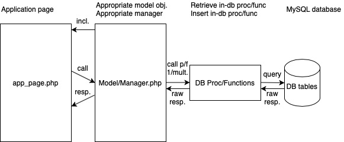

# SwimmPair Web Application
**SwimmPair** is a web application for managing swimming competitions in the Czech Republic. [Application model](http://docu-swimmpair.stkl.cz/annotated.html) describes administrative objects, such as `cups`, `clubs`, `users` etc. The main goal is to automate administrative work formerly achived via Excel spreadsheets and provide decent archivation history.  


*Preview of SwimmPair - **public page** of `Cup` - **available** & **paired** `Users`.*


## Web Application Structure Overview
Our web application consists of these main parts:
* **public** part - www,
* **private** admin - www/admin,
* app **model** - www/model,
* mysql **database procedures** used by the model,
* **tests** - execute **phpunit** on www/tests/Unit/* (automatically run in [GitHub Actions workflow](https://github.com/KlosStepan/SwimmPair-Www/blob/master/.github/workflows/main.yml)).  

Other stuff that comes with our project in this repo:
* **Doxyfile** - for HTML docummentation ([http://docu-swimmpair.stkl.cz](http://docu-swimmpair.stkl.cz)),
* **Doxyfile2** - for PDF docummentation ([_doc/pdf/refman.pdf](https://github.com/KlosStepan/SwimmPair-Www/blob/master/_doc/pdf/refman.pdf)),
* **docker-compose.yaml** - for my local development,
* 2 **database scripts** (_db/*) - [1 w/ basic data](https://github.com/KlosStepan/SwimmPair-Www/blob/master/_db/1_create_proc_schema_init_data.sql) & [1 w/ set of demonstration data](https://github.com/KlosStepan/SwimmPair-Www/blob/master/_db/1b_create_proc_schema_all_data.sql),
* **Dockerfile** - for building pullable [image](https://hub.docker.com/repository/docker/stepanklos/swimmpair/general) of SwimmPair application.
<!---
## Web Application Model Data Categorization
SwimmPair implements several structures to be used for administration of the competitions.  

Following objects are:
* **Post**/PostsManager - informative posts on the homepage,
* **Page**/PagesManager - info pages,
* **Club**/ClubsManager - organization units of cups,
* **Cup**/CupsManager - swimming competitions,
* **Region**/RegionsManager - geographical regions,
* **User**/UsersManager - app users (admins, club managers, admins),
* **Position**/Positions - work required for cups.
-->

## Web Application Data Flow Architecture Overview
Application flow is realized by accessing `application page` and calling `Managers` functionality (folder www/model), that wrapps database calls and returns results as PHP objects.  

<p align="center">
  
</p>

Public and private part have **PHP form-actions** and **Ajax endpoints** for achieving functionality via. appropriate `manager calls` and storing payloads sent to them via HTTP POST.

## Containerized Local Development
SwimmPair is shipped for production as [Docker image](https://www.docker.com). It can be run locally by [docker-compose](https://docs.docker.com/compose), starting **SwimmPair** - volume for www_php_1 being `www folder` + **MySQL**, **Adminer**, and **Redis** containers.  
### Docker desktop of `docker-compose up -d` for SwimmPair application
  

<!---
Local development **docker-compose.yaml**:
```yaml
version: "3.9"
services:
  adminer:
    image: adminer
    ports:
      - 8080:8080
  database:
    image: mysql:8.0
    environment:
      MYSQL_ROOT_PASSWORD: "${MYSQL_ROOT_PASSWORD}"
    volumes:
      - mysql-data:/var/lib/mysql
  redis:
    image: redis
    ports:
      - "6379:6379"
    environment:
      REDIS_HOST: "redis"
    command: redis-server --save 20 1 --loglevel warning --requirepass aGVzbG8=
    volumes:
      - redis-data:/data
  php:
    image: thecodingmachine/php:7.4-v4-apache
    depends_on:
      - database
      - redis
    ports:
      - "80:80"
    environment:
      DATABASE_HOST: '${DATABASE_HOST}'
      DATABASE_USER: '${DATABASE_USER}'
      DATABASE_PASS: '${DATABASE_PASS}'
      DATABASE_NAME: '${DATABASE_NAME}'
      PHP_INI_SESSION__SAVE_HANDLER: 'redis'
      PHP_INI_SESSION__SAVE_PATH: 'tcp://redis:6379?auth=aGVzbG8='
    volumes:
      - ./:/var/www/html
volumes:
  mysql-data:
  redis-data:
```
-->
## Dockerization - Production & Deployment Notes
Bundling PHP files into **Docker image** with base **PHP/Apache image** is defined by `Dockerfile`.  

```dockerfile
FROM thecodingmachine/php:7.4-v4-apache
COPY --chown=docker . /var/www/html
```
[Dockerhub](https://hub.docker.com) is default and public namespace for pulling all images - our image can be tagged as [stepanklos/swimmpair](https://hub.docker.com/repository/docker/stepanklos/swimmpair) and therefore be accessible publicly by this name.  

Build & Push **Docker image** of SwimmPair, tagged as **stepanklos/swimmpair**.
```zsh
docker build -t stepanklos/swimmpair .
docker push stepanklos/swimmpair
```

Bundled application image doesn't come with **database** and **adminer/phpmyadmin** or **Redis**. We advise production on cloud provider with database/redis services or use self-hosted database/redis solution storing in `Persistent Storage` accessed via `Persistent Volume Claim`.  

Installing **MySQL Database** like [mysql-deployment](https://github.com/KlosStepan/DOKS-tutorial/tree/main/mysql-deployment) or **Redis** like [redis-deployment](https://github.com/KlosStepan/DOKS-tutorial/tree/main/redis-deployment) into Kubernetes cluster shouldn't be a problem. 

# SwimmPair  Misc.
## Running instances  
* Visit [swimmpair.stkl.cz](http://swimmpair.stkl.cz) - development version of the application with dummy data.  
<!--[SwimmPair090.STKL.cz](http://swimmpair090.stkl.cz) - Legacy v0.90 pre refactor w/ old real data.-->
<!--- [SwimmPair.cz](http://swimmpair.cz) - Production version of application.  -->
## Database scripts
* Schema w/ very slim data - **_db/1_create_proc_schema_init_data.sql**
* Schema full of data - **_db/1b_create_proc_schema_all_data.sql**
## Documentation Doxygen HTML & PDF
Docker image for http://docu.swimmpair.cz<!--- / http://docu-swimmpair.stkl.cz --> or PDF.
### Documentation Doxygen HTML
```bash
> www: doxygen Doxyfile
> www: cd _doc/html
> www/_doc/html: docker build -t stepanklos/docu-swimmpair .
> www/_doc_html: docker push stepanklos/docu-swimmpair
```
### Documentation Doxygen PDF
```bash
> www: doxygen Doxyfile2
> www: cd _doc/latex
> www/_doc/latex: make
> www/_doc/latex: cd ..
> www/_doc: mkdir -p pdf
> www/_doc: cp latex/refman.pdf pdf/
```
It is necessary to have installed Doxygen whereabouts.
## Try it out!
```shell script
git clone https://github.com/KlosStepan/SwimmPair-Www
docker-compose up --detach 
mysql -h ${DATABASE_HOST} -u ${DATABASE_USER} --password=${DATABASE_PASS} < ./_db/1_create_proc_schema_init_data.sql
```

# SwimmPair Production in DOKS
Several production options in container cloud service providers are possible, be it ECS or EKS in Amazon AWS, some AKS alternative in Microsoft Azure, or self-hosted Kubernetes/Rancher/OpenShift/VMware Tanzu.

We use [DigitalOcean Kubernetes](https://www.digitalocean.com/products/kubernetes) because it suits us the best (despite being a little bit pricy ~$40/m).  

It is advised to run SwimmPair based on these [K8s notes](https://github.com/KlosStepan/DOKS-tutorial) as follows:
- **Application**: Service + Deployment utilizing **stepanklos/swimmpair**.
- **MySQL DB**:
  - either Public Service - Service + Deployment + PVC -> PV,
  - or https://www.digitalocean.com/pricing/managed-databases.
- **Database Client**: command line / Adminer Deployment / administration dashboard of chosen cloud provider.  

Consider `2 Node Cluster` and running `1 app replica` on each of them. Reference **swimmpair-service** `Service` from `Ingress` for cluster routing to access **swimmpair** Deployment with spawned `2 Pods` (of up-to-date `Replica Set`). 


## Kubernetes `Service` + `Deployment` of SwimmPair
Configuration file **app-swimmpair.yaml**:
```yaml
apiVersion: v1
kind: Service
metadata:
  name: swimmpair-service
spec:
  type: ClusterIP
  ports:
  - port: 80
    targetPort: 80
  selector:
    app: swimmpair
---
apiVersion: apps/v1
kind: Deployment
metadata:
  name: swimmpair
spec:
  replicas: 2
  selector:
    matchLabels:
      app: swimmpair
  template:
    metadata:
      labels:
        app: swimmpair
    spec:
      containers:
      - name: swimmpair
        image: stepanklos/swimmpair:latest
        securityContext:
          allowPrivilegeEscalation: true
        ports:
        - containerPort: 80
        env:
        - name: MESSAGE
          value: Hello from swimmpair Deployment!
        - name: DATABASE_HOST
          value: 'mysql-service'
        - name: DATABASE_USER
          value: 'user'
        - name: DATABASE_PASS
          value: 'password'
        - name: DATABASE_NAME
          value: 'db'    
```
## Ingress settings
Ingress, add SwimmPair to config section `rules:` as following snippet: 
```yaml
  - host: "swimmpair.stkl.cz"
    http:
      paths:
      - pathType: Prefix
        path: "/"
        backend:
          service:
            name: swimmpair-service
            port:
              number: 80
```
## Run - Apply changes via kubectl
Finally, apply `SwimmPair yaml config` and reapply `Ingress yaml config` as noted
```zsh
kubectl apply -f app-swimmpair.yaml
kubectl apply -f kubernetes-ingress-config.yaml
```
to achieve desired state of running application in the **Kubernetes Cluster**.